

   <h1 class='title level-1'>PC_Vagrant</h1> 
  

  <h2 class='title level-2'>1.- Volatility</h1> 
  

  <h3 class='title level-3'>1.- ImageInfo</h1> 
  
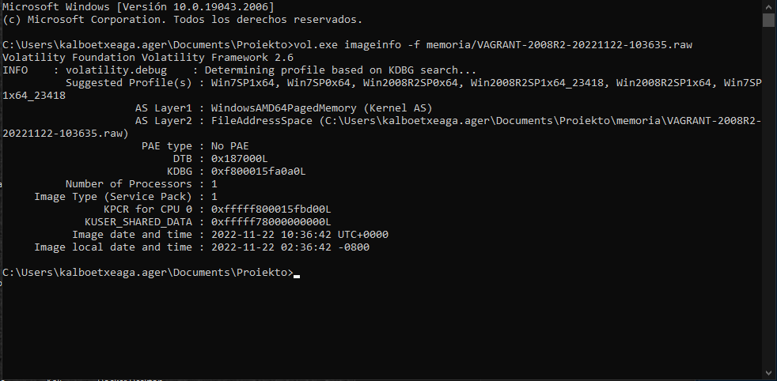

  

- Zela eta win2008R2SP1x64 sistema agertzen den hau artuko dugu ondorengo probak egiteko

  <h1 class='title level-3'>2.- PSScan</h1> 
  
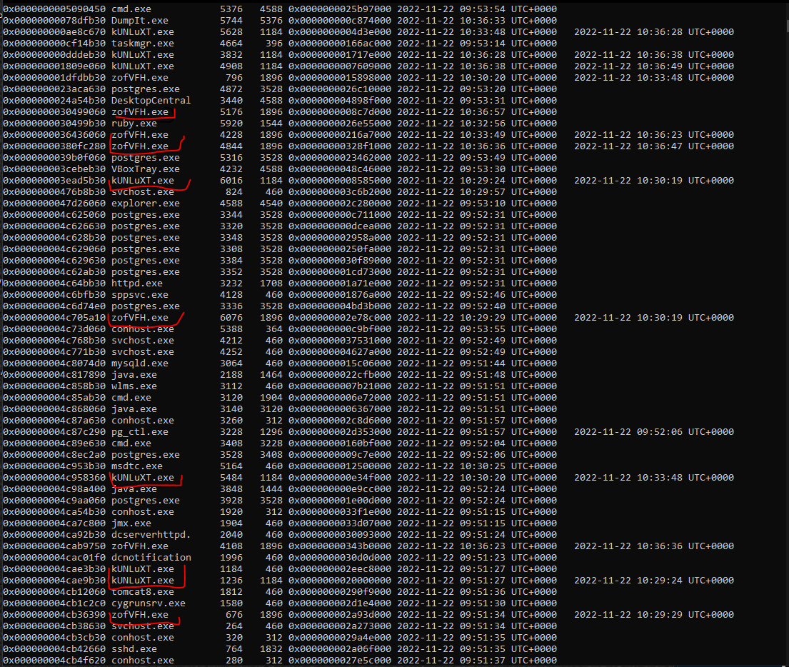
    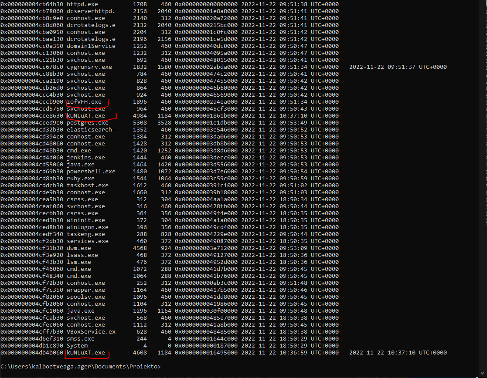
  

  
- Prozesuak ikusita iadanik sospetxoso batzuk agertu dira 

  <h1 class='title level-3'>3.- ProcDump</h1> 
  
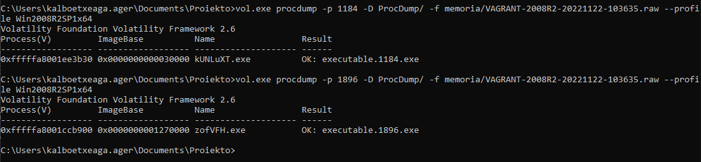

  <h1 class='title level-4'>kUNLuXT strings</h1> 
  
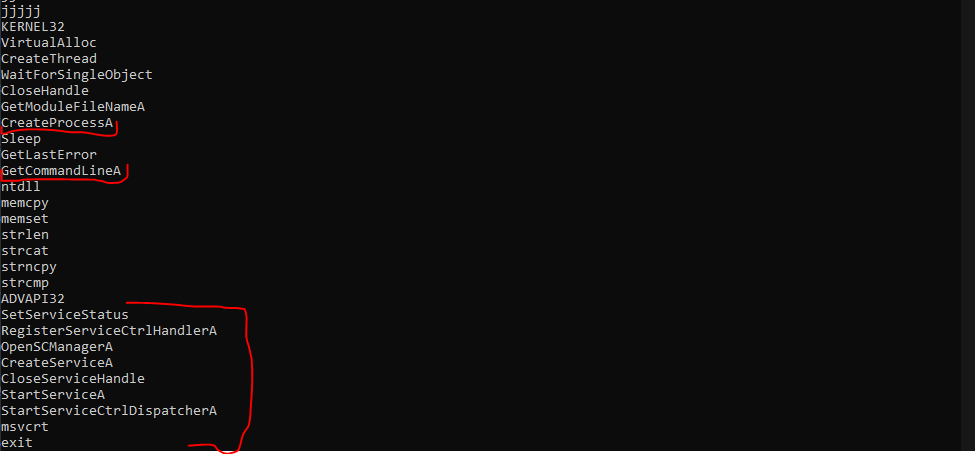

  

 - Lehenik CMD a eskuratzen sahiatzen da eta ostean Zerbitzua hasita ez badago hazten du.

  <h1 class='title level-4'>zofVFH strings</h1> 
  
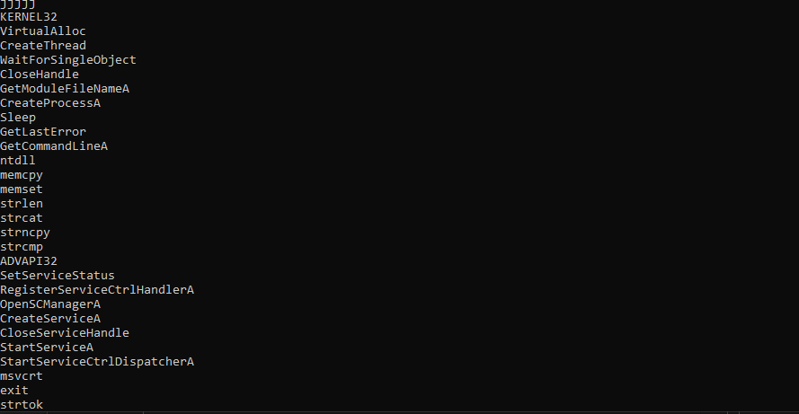

  
- Aurreko kasu berdina. Programak haria sortzen du, ostean prozesua, Command line bat hartzen sahiatzen da eta ondoren zerbitzu bat ezartzen sahiatzen da.

  <h1 class='title level-4'>Malware CMD LINES</h1> 
  
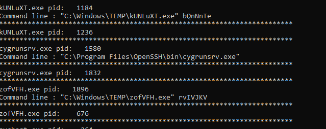

  <h1 class='title level-3'>4.- DllLISt</h1> 
  
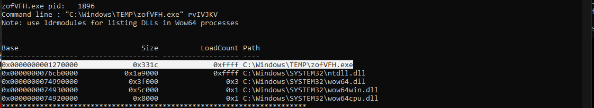

  
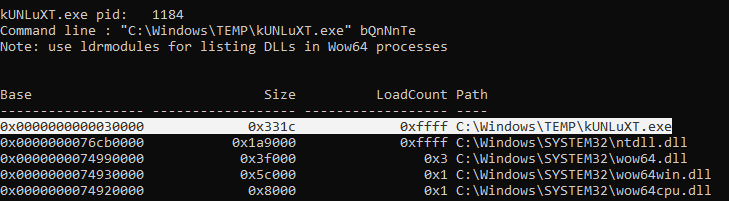

  <h1 class='title level-3'>5.- NetScan</h1> 

  
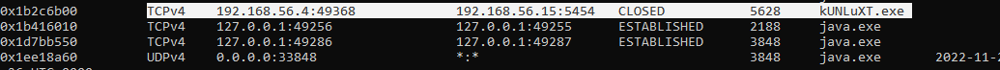

  
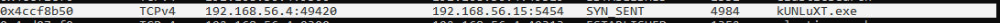

  
- Hemen, programa honek nola 192.168.56.15 makinara 5454 porturako konekxioa ixten dela ikusi dezakegu, eta hortik gutxira, makina biktimak syn eskaera bat bidaltzen dio atakantearen makinari

  
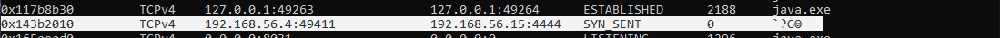

  
- Hemen, beste backdor batera konektatzen nahian dagoela ikusi dezakegu. Oraingoan 4444 portura

  <h1 class='title level-2'>2.- NetworkMiner</h1> 
  

  <h1 class='title level-3'>1.- Nmap Scanning</h1> 
  
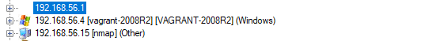

	- Hasieratik nmap eskaneo bat martxan dagoela salatzen digu

	

  
	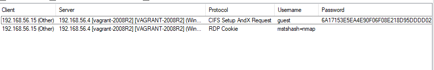

	

  
	Kredentzial batzuen lapurreta dagoela ikusi dezakegu CIFS Setup AndX Request (smb baten kredentzialak uste dut) guest:6A17153E5EA4E90F06F08E218D95DDDD02A8B90C5E0A7C76

	

  
	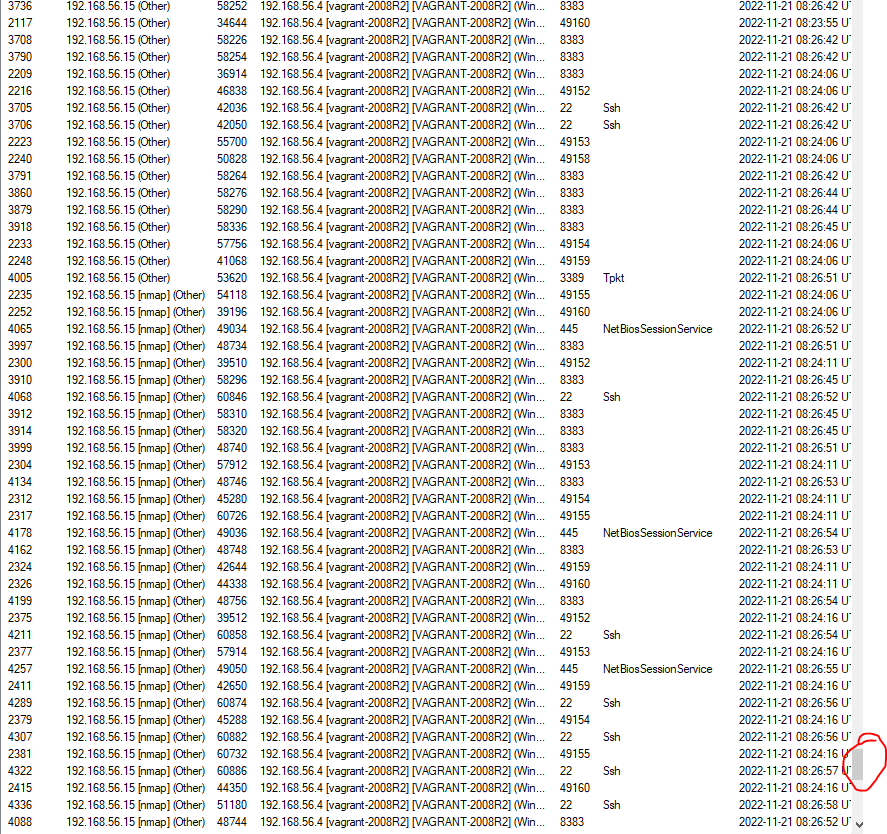

	

  
		- Nmap eskaneoak egin dituen galderak (zarata asko egiten du!)

		

  
		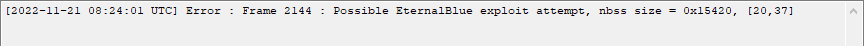

		

  
		 Ikusi dezakegunez hakerra iadanik jugeton dago

  <h1 class='title level-3'>2.- Backdoor kaptura (Eternal Blue)</h1> 
  
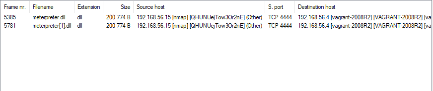

  
-	Hemen atakanteak erabili duen reverse shell- aren aztarnak agertzen dira. Datu hauekin badakigu metasploit erabiltzen dagoela eta Vagrant sisteman iadanik sartuta dagoela. Shell honek atakantearen 4444 portura dago apuntatuta. Baliteke hau persistentziaren shell a izatea

  
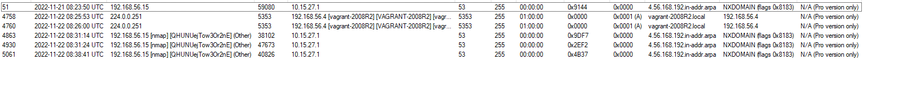

  
-	DNS an gauza arraroak ikusi ditzakegu

  
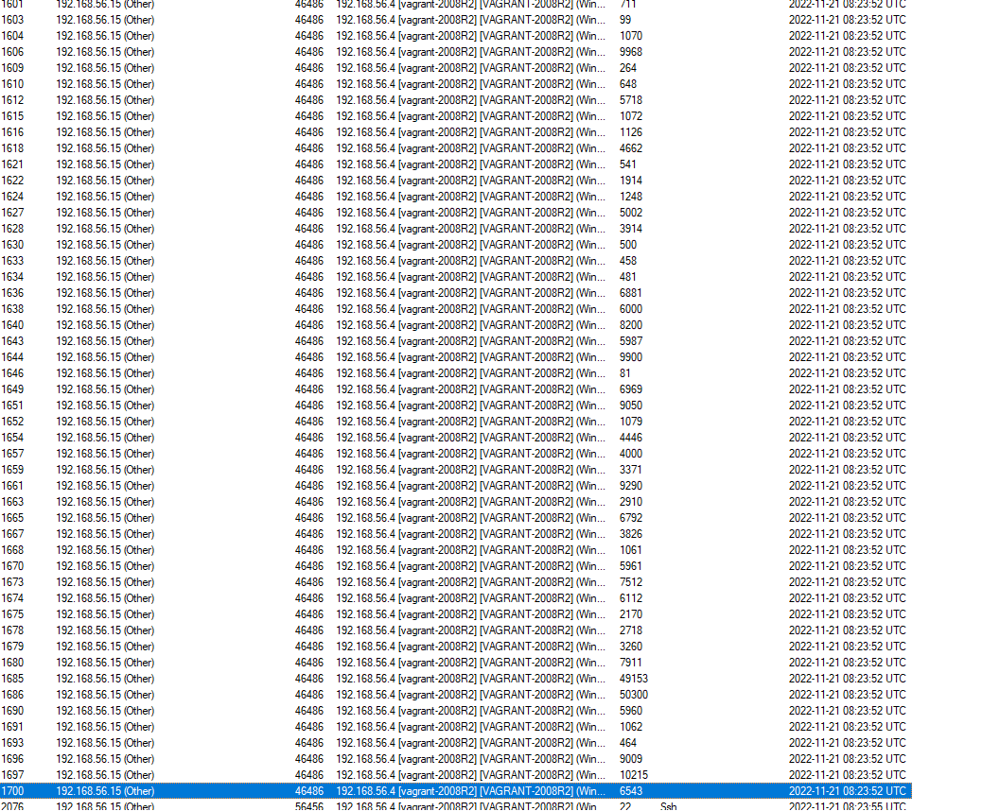

  
- Hemen makina atakanteak +1700 konekxio egiten ditu (3 segunduko tartean) vagrant makinarekin

  

  
Hemen eternal blue exploitaren saiakera bat ikusi dezakegu

  
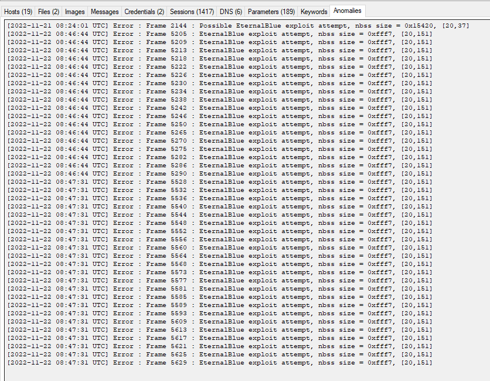

  
	- Hemen Eternal blue ahultasunaren explotazioa baieztatzen dugu

  <h1 class='title level-3'>3.- Backdoor Kaptura 2</h1> 
  
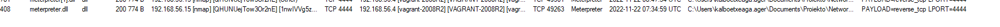

  
-	No ase falta palabrass

  
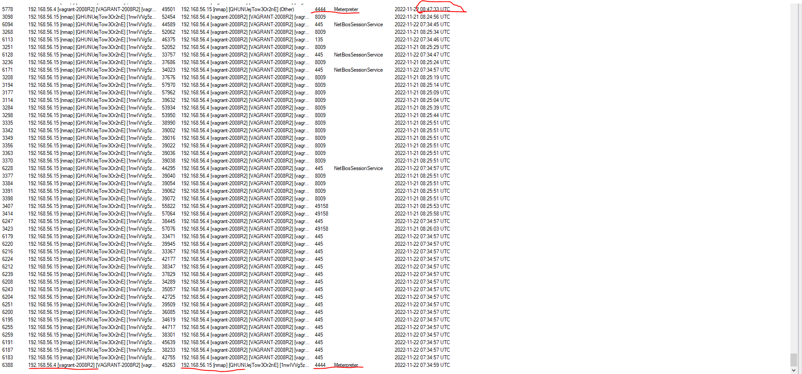

  
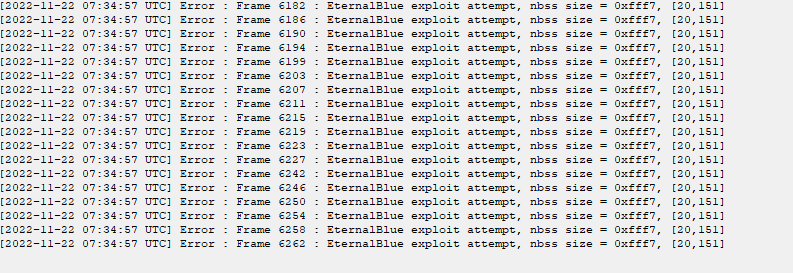

-	 -	Fijatzen bagara lehenengo meterpreter sesioa eternal blue exploitaren erantzuna izango litzateke. Ondoren, 20 minutura beste meterpreter sesio bat dago, Beraz backdoor batetik konektatzen dagoela ikus dezakegu

  <h1 class='title level-2'>3.- Wireshark</h1> 
  

  <h1 class='title level-3'>WIRESHARK Analisia</h1> 
  
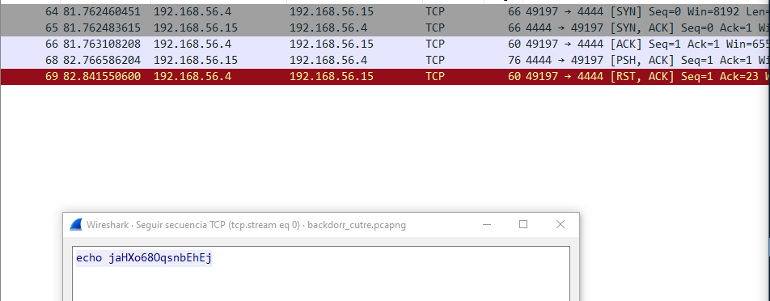

  
Konexio proba: (atakante-biktima)

  
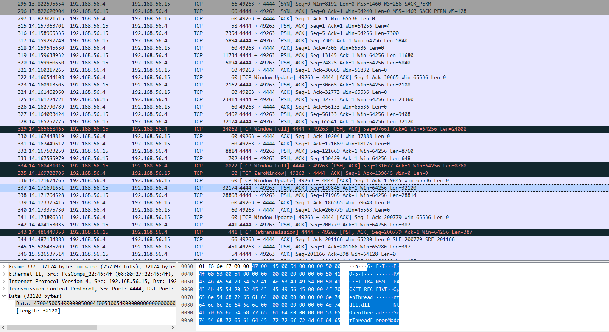

  
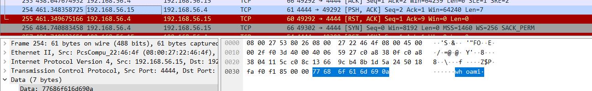

  
 Erasotzaileak bidalitako komandoa

